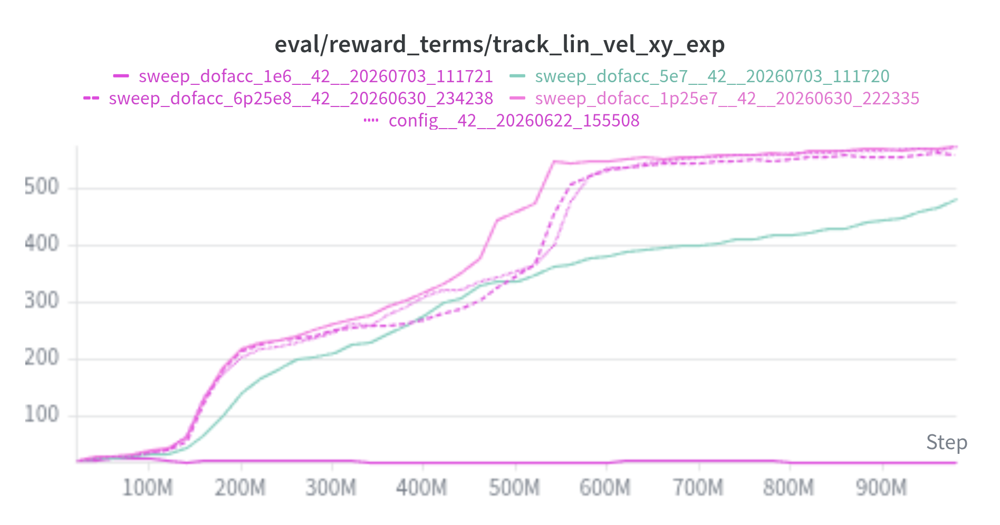
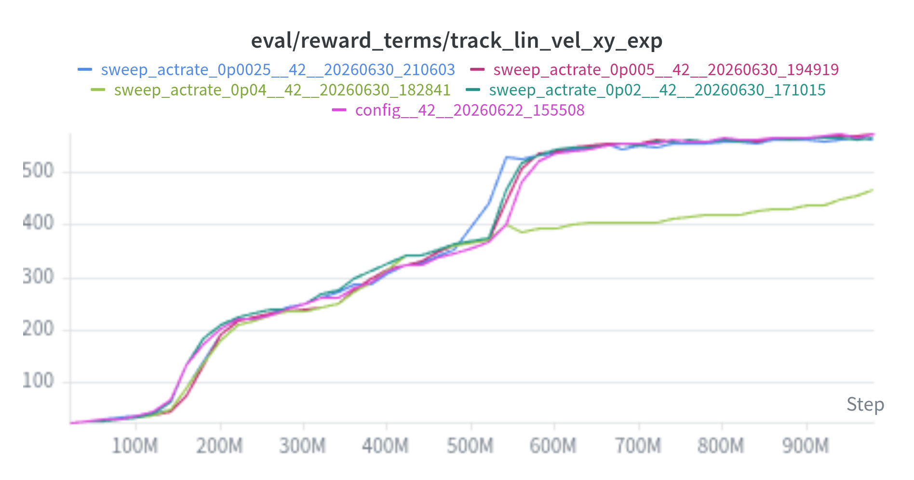
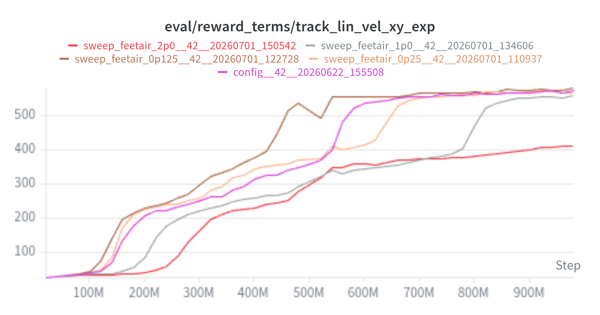
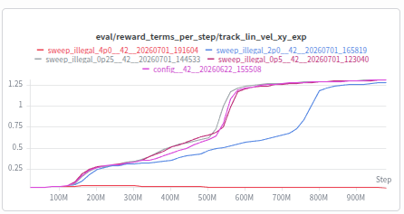
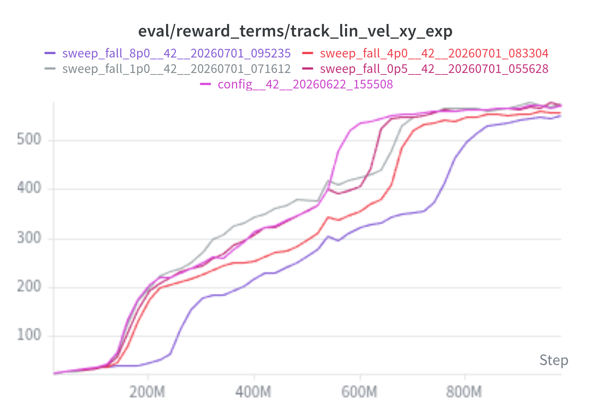
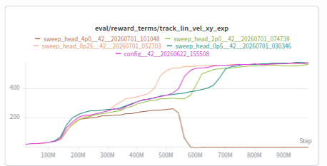
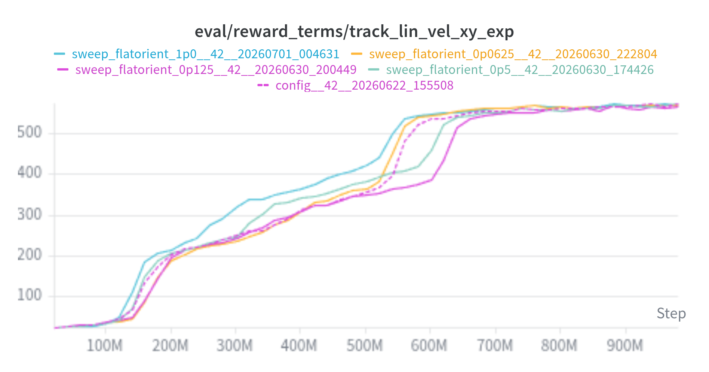

# Anotações Treinos

Config Mestre para avaliação das mudanças de parâmetros.

```python
# Go2 rough-terrain velocity training v18
# Key changes from v16:
#   - Added feet_slide penalty to directly punish foot dragging
#   - Wider command range restored ([-1.5, 1.5]), dragging fix is structural now
#   - DDP-optimized hyperparameters for 4 GPUs

seed: 42
torch_deterministic: true
cuda: true

track: true

video: true
video_length: 1600
video_mode: "during"
video_resolution: "1280x720"
video_num_envs: 18
video_poll_seconds: 15

total_timesteps: 500000000

checkpoint_every: 20000000
checkpoint_max_to_keep: 5
save_optimizer_in_ckpt: true

learning_rate: 0.001
num_envs: 16384
num_steps: 100
anneal_lr: false
gamma: 0.99
gae_lambda: 0.95
num_minibatches: 16
update_epochs: 5
norm_adv: true
clip_coef: 0.2
clip_vloss: true
ent_coef: 0.008
vf_coef: 0.5
max_grad_norm: 1.0
target_kl: null

use_obs_norm: true
obs_norm_epsilon: 1e-8

curriculum_cfg:
  schedule: cosine # linear cosine exponential step3 step5
  profile: full # forward_only planar full
  warmup_fraction: 0.1

env_kwargs:
  spacing: 3.0
  safety_margin: 0.1
  use_relative_control: False
  relative_scale: 0.1
  action_interval: 0.02
  scene: flat

  # command_lin_vel_x: [-1.5, 1.5]
  # command_lin_vel_y defaults to (0,0), forward only
  # command_ang_vel_z: [0.0, 0.0]
  static_friction_range: (0.8, 0.8)
  dynamic_friction_range: (0.6, 0.6)

  rewards:
    track_lin_vel_xy_exp: 1.5
    track_ang_vel_z_exp: 0.75

    lin_vel_z_l2: -2.0
    ang_vel_xy_l2: -0.05
    dof_torques_l2: -0.0002
    dof_acc_l2: -2.5e-7
    action_rate_l2: -0.01

    # Contact / gait terms
    feet_air_time: 0.5            # reward stepping (threshold=0.2s in code)
    feet_air_time_rear: 0.0
    feet_slide: -0.25             # NEW, directly penalizes foot velocity while in contact;
                                  # this is the actual fix for dragging: makes sliding feet
                                  # costly regardless of command magnitude
    undesired_contacts: -0.2

    illegal_contact_penalty: -1.0
    fall_penalty: -2.0
    head_contact_penalty: -1.0
    is_alive: 0.5

    flat_orientation_l2: -0.25
    dof_pos_limits: 0.0
```

**Vídeo Baseline**
<div class="video-panel">
  <p><strong>baseline</strong></p>
  <video controls preload="metadata">
    <source src="{{ '/videos/config_policy-step-999424000.mp4' | relative_url }}" type="video/mp4">
  </video>
</div>
Azul : Hipótese feita, os resultados confirmarão, ou não.
## Recompensas
o Isaac Lab multiplica **todo** termo por `dt` (≈0.02). Então a contribuição real por step é `weight × 1.0 × dt`.

```cs
value = term_cfg.func(self._env, **term_cfg.params) * term_cfg.weight * dt
```

O que vai pro wandb (`eval/reward_terms`) é o `value / dt`, ou seja, **sem o dt**, de volta pra `weight × func` = 0.5. Então **o gráfico mostra 0.5, mas a recompensa real é 0.01**. Os gráficos são normalizados "por segundo"; o reward de verdade é por-step (×dt). É por isso que os números do painel parecem maiores do que o que a política realmente otimiza.
Soma das recompensas é feita pelo IsaacLab:

```python
def compute(self, dt):
    self._reward_buf[:] = 0.0
    for name, term_cfg in zip(self._term_names, self._term_cfgs):
        if term_cfg.weight == 0.0:
            continue
        value = term_cfg.func(self._env, **term_cfg.params) * term_cfg.weight * dt
        self._reward_buf += value          # <<< soma de todos os termos
    return self._reward_buf
```

`R_total = Σ_i func_i(env) × weight_i × dt`
onde:
*   a soma é sobre **todos** os termos de recompensa (os que estamos documentando)
*   `weight_i` = peso de cada termo (do config/YAML)
*   `dt ≈ 0.02` (multiplica **todo** termo igualmente)
*   termos com `weight == 0` são pulados (não entram na soma)
É **esse** `R_total` (por env, por step) que vira a recompensa do PPO. Cada `func_i` é uma das recompensas individuais (track\_lin, track\_ang, feet\_slide, is\_alive, etc.).
### is\_alive

```python
def is_alive(env):
    return (~env.termination_manager.terminated).float()
```

Retorna **1.0** em todo step que o robô **não** terminou (não caiu/não resetou), e **0.0** no step em que termina.
Treinos:
Sweep isalive\_0: [wandb](https://wandb.ai/imdudak-federal-university-of-goi-s/Akcit-RL/runs/1uaj7uq0?nw=nwuserimdudak) | Sweep isalive\_1: [wandb](https://wandb.ai/imdudak-federal-university-of-goi-s/Akcit-RL/runs/sivema1e?nw=nwuserimdudak)

<div class="video-pair">
  <div class="video-panel">
    <p><strong>isalive_0</strong></p>
    <video controls preload="metadata">
      <source src="{{ '/videos/sweep_isalive_0_policy-step-999424000.mp4' | relative_url }}" type="video/mp4">
    </video>
  </div>
  <div class="video-panel">
    <p><strong>isalive_1p0</strong></p>
    <video controls preload="metadata">
      <source src="{{ '/videos/sweep_isalive_1p0_policy-step-999424000.mp4' | relative_url }}" type="video/mp4">
    </video>
  </div>
</div>

Com a recompensa desativada, o robô teve maior dificuldade para aprender a andar. Por outro lado, aumentar a recompensa para 1.0 piorou quase todos os gráficos(ou ficou muito parecido). 
### track\_lin\_vel\_xy\_exp
**Registro** (_go2\_env\_cfg.py:339_):

```python
"track_lin_vel_xy_exp": RewTerm(
    func=mdp.track_lin_vel_xy_exp,
    weight=weights["track_lin_vel_xy_exp"],            # 1.5 no baseline
    params={"command_name": "base_velocity", "std": math.sqrt(0.25)},  # std = 0.5
),
```

**Implementação** (Isaac Lab, _rewards.py:297_):

```python
def track_lin_vel_xy_exp(env, std, command_name, asset_cfg):
    lin_vel_error = torch.sum(
        torch.square(command[:, :2] - root_lin_vel_b[:, :2]),  # (Δvx)² + (Δvy)²
        dim=1,
    )
    return torch.exp(-lin_vel_error / std**2)
```

`r = exp( -[ (Δvx)² + (Δvy)² ] / std² )`
onde:
*   `Δv = v_comando − v_real`, medido no **body frame** (frame do robô)
*   `std = 0.5`, então `std² = 0.25`
_"quanto mais perto do comando, mais perto de 1"_

<div class="video-pair">
  <div class="video-panel">
    <p><strong>tracklin_0p5</strong></p>
    <video controls preload="metadata">
      <source src="{{ '/videos/sweep_tracklin_0p5_policy-step-999424000.mp4' | relative_url }}" type="video/mp4">
    </video>
  </div>
  <div class="video-panel">
    <p><strong>tracklin_1p0</strong></p>
    <video controls preload="metadata">
      <source src="{{ '/videos/sweep_tracklin_1p0_policy-step-999424000.mp4' | relative_url }}" type="video/mp4">
    </video>
  </div>
  <div class="video-panel">
    <p><strong>tracklin_3p0</strong></p>
    <video controls preload="metadata">
      <source src="{{ '/videos/sweep_tracklin_3p0_policy-step-999424000.mp4' | relative_url }}" type="video/mp4">
    </video>
  </div>
  <div class="video-panel">
    <p><strong>tracklin_5p0</strong></p>
    <video controls preload="metadata">
      <source src="{{ '/videos/sweep_tracklin_5p0_policy-step-999424000.mp4' | relative_url }}" type="video/mp4">
    </video>
  </div>
</div>

| config | valor | razão vs baseline (1.5) | Link |
| ---| ---| ---| --- |
| `sweep_tracklin_0p5.yml` | 0.5 | ÷3 | [wandb](https://wandb.ai/imdudak-federal-university-of-goi-s/Akcit-RL/runs/t8cqki1k?nw=nwuserimdudak) |
| `sweep_tracklin_1p0.yml` | 1.0 | ÷1.5 | [wandb](https://wandb.ai/imdudak-federal-university-of-goi-s/Akcit-RL/runs/41txvwq2?nw=nwuserimdudak) |
| `sweep_tracklin_3p0.yml` | 3.0 | ×2 | [wandb](https://wandb.ai/imdudak-federal-university-of-goi-s/Akcit-RL/runs/zga8mchg?nw=nwuserimdudak) |
| `sweep_tracklin_5p0.yml` | 5.0 | ×3 | [wandb](https://wandb.ai/imdudak-federal-university-of-goi-s/Akcit-RL/runs/men7c53s?nw=nwuserimdudak) |

É até então a recompensa que mais impacta na tarefa de andar do robô. Valores muito baixos simplesmente não conseguem dar o incentivo certeiro de andar. Valores altos demais fazem com que alcançar a velocidade X seja muito superior que respeitar o restante das recompensas.
### track\_ang\_vel\_z\_exp
**Registro** (_go2\_env\_cfg.py:344_):

```cs
"track_ang_vel_z_exp": RewTerm(
    func=mdp.track_ang_vel_z_exp,
    weight=weights["track_ang_vel_z_exp"],            # 0.75 no baseline
    params={"command_name": "base_velocity", "std": math.sqrt(0.25)},  # std = 0.5
),
```

**Implementação** (Isaac Lab, _rewards.py:308_):

```python
def track_ang_vel_z_exp(env, std, command_name, asset_cfg):
    ang_vel_error = torch.square(command[:, 2] - root_ang_vel_b[:, 2])  # (Δω)²
    return torch.exp(-ang_vel_error / std**2)
```

`r = exp( −(Δω)² / std² ) = exp( −4 · (Δω)² )`
*   `Δω = ω_cmd − ω_real` = erro da **taxa de giro** (yaw), no body frame
*   `std = 0.5` (mesmo `math.sqrt(0.25)`, linha 347) → `std² = 0.25`
*   peso baseline = **0.75** (metade do `track_lin` 1.5)
_"quanto mais perto do comando, mais perto de 1"_

<div class="video-pair">
  <div class="video-panel">
    <p><strong>trackang_0p25</strong></p>
    <video controls preload="metadata">
      <source src="{{ '/videos/sweep_trackang_0p25_policy-step-999424000.mp4' | relative_url }}" type="video/mp4">
    </video>
  </div>
  <div class="video-panel">
    <p><strong>trackang_0p5</strong></p>
    <video controls preload="metadata">
      <source src="{{ '/videos/sweep_trackang_0p5_policy-step-999424000.mp4' | relative_url }}" type="video/mp4">
    </video>
  </div>
  <div class="video-panel">
    <p><strong>trackang_1p5</strong></p>
    <video controls preload="metadata">
      <source src="{{ '/videos/sweep_trackang_1p5_policy-step-999424000.mp4' | relative_url }}" type="video/mp4">
    </video>
  </div>
  <div class="video-panel">
    <p><strong>trackang_3p0</strong></p>
    <video controls preload="metadata">
      <source src="{{ '/videos/sweep_trackang_3p0_policy-step-999424000.mp4' | relative_url }}" type="video/mp4">
    </video>
  </div>
</div>

| config | valor | razão vs baseline (0.75) | links |
| ---| ---| ---| --- |
| `sweep_trackang_0p25.yml` | 0.25 | ÷3 | [wandb](https://wandb.ai/imdudak-federal-university-of-goi-s/Akcit-RL/runs/fo3uec6e?nw=nwuserimdudak) |
| `sweep_trackang_0p5.yml` | 0.5 | ÷1.5 | [wandb](https://wandb.ai/imdudak-federal-university-of-goi-s/Akcit-RL/runs/aadvv7fk?nw=nwuserimdudak) |
| `sweep_trackang_1p5.yml` | 1.5 | ×2 | [wandb](https://wandb.ai/imdudak-federal-university-of-goi-s/Akcit-RL/runs/5c8bn5bw?nw=nwuserimdudak) |
| `sweep_trackang_3p0.yml` | 3.0 | ×4 | [wandb](https://wandb.ai/imdudak-federal-university-of-goi-s/Akcit-RL/runs/hy621to7?nw=nwuserimdudak) |

As recompensas lin\_vel\_z e lin\_vel\_xy competem entre si.


### lin\_vel\_z\_l2
**Registro** (_go2\_env\_cfg.py:349_):

```python
"lin_vel_z_l2": RewTerm(func=mdp.lin_vel_z_l2, weight=weights["lin_vel_z_l2"]),  # -2.0 no baseline
```

**Implementação** (Isaac Lab, rewards.py):

```python
def lin_vel_z_l2(env, asset_cfg):
    return torch.square(asset.data.root_lin_vel_b[:, 2])   # (vz)²
```

`penalidade = (v_z)²`
onde:
*   `v_z` = velocidade linear do tronco no eixo **vertical (z)**, no body frame
*   peso **−2.0** (negativo → é penalidade)
#### O que ela faz
Pune o tronco **subir e descer** (movimento vertical). É um kernel **L2** (quadrático), sem `exp`: cresce com o **quadrado** da velocidade vertical, então velocidade pequena custa pouco, mas velocidade grande custa **muito** (penaliza picos bruscos).
A ideia: numa caminhada boa, o tronco deve ficar numa altura **estável**, sem **quicar**. Toda vez que o robô pula, balança verticalmente ou bate no chão e ressalta, gera `v_z` ≠ 0 e é punido.

<div class="video-pair">
  <div class="video-panel">
    <p><strong>linvelz_5p0</strong></p>
    <video controls preload="metadata">
      <source src="{{ '/videos/sweep_linvelz_5p0_policy-step-999424000.mp4' | relative_url }}" type="video/mp4">
    </video>
  </div>
  <div class="video-panel">
    <p><strong>linvelz_3p0</strong></p>
    <video controls preload="metadata">
      <source src="{{ '/videos/sweep_linvelz_3p0_policy-step-999424000.mp4' | relative_url }}" type="video/mp4">
    </video>
  </div>
  <div class="video-panel">
    <p><strong>linvelz_1p0</strong></p>
    <video controls preload="metadata">
      <source src="{{ '/videos/sweep_linvelz_1p0_policy-step-999424000.mp4' | relative_url }}" type="video/mp4">
    </video>
  </div>
  <div class="video-panel">
    <p><strong>linvelz_0p5</strong></p>
    <video controls preload="metadata">
      <source src="{{ '/videos/sweep_linvelz_0p5_policy-step-999424000.mp4' | relative_url }}" type="video/mp4">
    </video>
  </div>
</div>

| config | valor | razão vs baseline (-2.0) | comportamento | métricas |
| ---| ---| ---| ---| --- |
| `sweep_linvelz_0p5.yml` | -0.5 | ÷4 | | [wandb](https://wandb.ai/imdudak-federal-university-of-goi-s/Akcit-RL/runs/8t87nzu9?nw=nwuserimdudak) |
| `sweep_linvelz_1p0.yml` | -1.0 | ÷2 | | [wandb](https://wandb.ai/imdudak-federal-university-of-goi-s/Akcit-RL/runs/yl791myf?nw=nwuserimdudak) |
| `sweep_linvelz_3p0.yml` | -3.0 | ×1.5 | | [wandb](https://wandb.ai/imdudak-federal-university-of-goi-s/Akcit-RL/runs/907uhqs5?nw=nwuserimdudak) |
| `sweep_linvelz_5p0.yml` | -5.0 | ×2.5 | | [wandb](https://wandb.ai/imdudak-federal-university-of-goi-s/Akcit-RL/runs/1qy8uvjm?nw=nwuserimdudak) |

### ang\_vel\_xy\_l2
**Registro** (_go2\_env\_cfg.py:350_):

```python
"ang_vel_xy_l2": RewTerm(func=mdp.ang_vel_xy_l2, weight=weights["ang_vel_xy_l2"]),  # -0.05 no baseline
```

**Implementação** (Isaac Lab, _rewards.py:83_):

```python
def ang_vel_xy_l2(env, asset_cfg):
    return torch.sum(torch.square(asset.data.root_ang_vel_b[:, :2]), dim=1)  # ω_roll² + ω_pitch²
```

`penalidade = ω_x² + ω_y²`
onde:
*   `ω_x, ω_y` = taxas de **roll** e **pitch** do tronco (body frame)
*   peso **−0.05** (negativo → penalidade)

Kernel **L2** (sem `exp`): pune o tronco **balançar/tombar**, cabecear pra frente/trás e rolar de lado. Cresce com o quadrado da velocidade angular, então oscilação pequena custa pouco e tombo brusco custa muito. Não pune o giro de **yaw** (eixo z), esse é tarefa do `track_ang_vel_z_exp`.

| config | valor | razão vs baseline (-0.05) | comportamento | métricas |
| ---| ---| ---| ---| --- |
| `sweep_angvelxy_0p01.yml` | -0.01 | ÷5 | anda, mas **bem instável**, oscila muito | [wandb](https://wandb.ai/imdudak-federal-university-of-goi-s/Akcit-RL/runs/1jpose7l?nw=nwuserimdudak) |
| `sweep_angvelxy_0p025.yml` | -0.025 | ÷2 | anda, com **problemas de equilíbrio** | [wandb](https://wandb.ai/imdudak-federal-university-of-goi-s/Akcit-RL/runs/0jeih3hj?nw=nwuserimdudak) |
| `sweep_angvelxy_0p1.yml` | -0.1 | ×2 | anda, mas **pior** que o baseline | [wandb](https://wandb.ai/imdudak-federal-university-of-goi-s/Akcit-RL/runs/zmt35egs?nw=nwuserimdudak) |
| `sweep_angvelxy_0p2.yml` | -0.2 | ×4 | **não anda direito**, trava sem transicionar | [wandb](https://wandb.ai/imdudak-federal-university-of-goi-s/Akcit-RL/runs/ucv9ql2c?nw=nwuserimdudak) |

<div class="video-pair">
  <div class="video-panel">
    <p><strong>angvelxy_0p01</strong></p>
    <video controls preload="metadata">
      <source src="{{ '/videos/sweep_angvelxy_0p01_policy-step-999424000.mp4' | relative_url }}" type="video/mp4">
    </video>
  </div>
  <div class="video-panel">
    <p><strong>angvelxy_0p025</strong></p>
    <video controls preload="metadata">
      <source src="{{ '/videos/sweep_angvelxy_0p025_policy-step-999424000.mp4' | relative_url }}" type="video/mp4">
    </video>
  </div>
  <div class="video-panel">
    <p><strong>angvelxy_0p1</strong></p>
    <video controls preload="metadata">
      <source src="{{ '/videos/sweep_angvelxy_0p1_policy-step-999424000.mp4' | relative_url }}" type="video/mp4">
    </video>
  </div>
  <div class="video-panel">
    <p><strong>angvelxy_0p2</strong></p>
    <video controls preload="metadata">
      <source src="{{ '/videos/sweep_angvelxy_0p2_policy-step-999424000.mp4' | relative_url }}" type="video/mp4">
    </video>
  </div>
</div>

**Resultados do sweep, dois modos de falha assimétricos:**

Os vídeos deixam claro que **ambos os extremos degradam, por motivos opostos**, e que os termos de custo, sozinhos, *enganam*.

*   **Abaixar → instabilidade** (`-0.01`, `-0.025`): sem a penalidade segurando roll/pitch, o robô **anda mas oscila**. O `0p01` (÷5) é o pior, bem instável, tronco balançando o tempo todo; o `0p025` (÷2) anda com problemas de equilíbrio visíveis. Aqui o termo está sub-dimensionado: não faz o trabalho de estabilização postural pra que ele existe. Nos gráficos, esses runs mostram `ang_vel_xy_l2` mais negativo (mais oscilação "passando") e transicionam pra caminhada **cedo**, mas a caminhada resultante é de baixa qualidade.

*   **Aumentar → barreira de energia / freeze** (`-0.2`): o `0p2` (×4) simplesmente **não anda direito**. Não é rigidez que faz ele cair, é que a penalidade vira uma **barreira** que impede a transição pra caminhada. Igual ao `illegal_contact ×4`: aprender a andar exige atravessar uma fase desajeitada com bastante roll/pitch (o robô cambaleia antes de firmar o gait), e um peso ×4 torna essa fase cara demais. O PPO nunca acha que vale a pena atravessar → **trava no ótimo local "ficar de pé parado"**. O `0p1` (×2) ainda atravessa, mas a caminhada sai pior que o baseline (transição atrasada, movimento mais contido).

*   **A armadilha dos termos de custo:** quanto MAIOR o peso, "melhores" ficam `dof_acc_l2`, `action_rate_l2`, `is_alive`, `feet_air_time` e até `lin_vel_z_l2`, todos menos negativos pro `0p2`. Já a 240M o `0p2` lidera esses cinco (ex.: `dof_torques` −0.104 vs −0.127 do `0p01`; `is_alive` 0.5000 vs 0.49994; `illegal_contact` −0.00036 vs −0.0045). É **ilusão**, o mesmo efeito do `head_contact_penalty`: todo termo de **custo** (suavidade, sobrevivência, contato) é minimizado por um robô que quase não se mexe, não cai, não gasta torque em manobra, não acelera junta nenhuma. Isso vale medindo per-step **ou** episódico: o problema não é a normalização, é que esses termos premiam inatividade. Os runs que **de fato andam** (pesos menores) pagam o pedágio: `is_alive` cai na transição, `dof_acc`/`action_rate` sobem porque movimento real custa. **Os termos de custo premiam quem desiste da tarefa.**

*   **A métrica honesta confirma a conformidade:** o gráfico que importa, `eval/reward_terms/track_lin_vel_xy_exp` (tracking episódico acumulado, a tarefa de fato), coloca o `0p2` **em último, disparado** (satura em ~200 enquanto `0p01`/`0p025` sobem pra ~450 depois de 400M). Não há paradoxo: a única métrica que não dá pra "hackear ficando parado" ordena as configs como o vídeo mostra. **Regra prática: julgue o sweep pelo `track_lin_vel_xy_exp`, não pelos termos de custo/penalidade.**

*   **Contraprova via tamanho de episódio (o dado que fecha):** em `charts/num_episodes`, o `0p2` tem **menos** episódios (~1.2M vs ~1.7M dos outros) → episódios **mais longos** → ele fica de pé até o timeout sem cair. Isso *infla* toda métrica acumulada por episódio (por isso `is_alive` e `track_ang_vel_z` episódicos do `0p2` parecem altos). Mesmo com essa vantagem de episódio comprido, o `track_lin_vel_xy_exp` dele continua no chão, ou seja, **mesmo tendo mais tempo pra somar reward de tracking, ele não soma, porque não avança.** É a prova irrefutável do freeze.

*   **O outro extremo cobra em qualidade de gait, não em tracking (nem em queda):** o `0p01` (÷5) e o `0p025` (÷2) têm o **melhor** `track_lin_vel_xy_exp` episódico, comprometem-se com a caminhada cedo e andam rápido. Onde pagam é no balanço do tronco: são os **piores** em `fall_penalty` e `illegal_contact_penalty` per-step (`0p01`: fall −0.035, illegal −0.0045; ~8× e ~5× o baseline), o que bate com o cambaleio do vídeo. Mas atenção à escala: em **absoluto** esses valores continuam minúsculos, ou seja, o robô **não cai de verdade**, são tropeços/roçadas ocasionais. O efeito visível é só andar **mais bambo e esquisito**, não desabar. O baseline (-0.05) troca um pouco de tracking bruto por um tronco mais firme, anda controlado.

*   **Por que roll/pitch são críticos, não cosméticos:** diferente de termos de ajuste fino (`dof_torques`, `action_rate`), o `ang_vel_xy_l2` regula uma **ferramenta de equilíbrio ativo**. O tronco precisa balançar *um pouco* pra fazer as transições de apoio dos pés durante a passada. Zerar isso (peso alto) mata a caminhada; liberar demais (peso baixo) deixa o balanço virar cambaleio. Não há platô confortável no meio, por isso a janela é estreita.

**Conclusão do `ang_vel_xy_l2`:** janela **muito estreita**, baseline (-0.05) no ponto ótimo, com **dois modos de falha simétricos em sintoma mas opostos em causa**. Sub-peso (`≤ -0.025`): anda **rápido mas mais bambo/esquisito**, melhor tracking bruto, tronco cambaleando mais (sem chegar a cair, o termo só deixa de firmar o gait). Sobre-peso (`-0.1` → `-0.2`): caminhada pior evoluindo pra **freeze total**, mesma barreira de energia do `illegal_contact ×4`, onde a fase desajeitada (cambaleio necessário pra aprender) fica cara demais e o PPO nunca atravessa. O caso é um **alerta metodológico duplo**: (1) os **termos de custo** (suavidade/sobrevivência/contato) *melhoram* monotonicamente com o peso justamente porque o robô abandona a tarefa, vale medindo per-step ou episódico; (2) além disso, as somas **episódicas** são ainda mais infladas por episódios mais longos do robô parado. As duas conspiram pra fazer o `-0.2` parecer a melhor config no dashboard. Só o `track_lin_vel_xy_exp`, a métrica que não dá pra hackear ficando parado, e o vídeo revelam a verdade.

### dof\_torques\_l2
**Registro** (_go2\_env\_cfg.py:351_):

```python
"dof_torques_l2": RewTerm(func=mdp.joint_torques_l2, weight=weights["dof_torques_l2"]),  # -0.0002 no baseline
```

**Implementação** (Isaac Lab, _rewards.py:136_):

```python
def joint_torques_l2(env, asset_cfg):
    return torch.sum(torch.square(asset.data.applied_torque[:, asset_cfg.joint_ids]), dim=1)  # Σ τ²
```

`penalidade = Σ_junta τ²`
onde:
*   `τ` = torque aplicado em cada junta
*   peso **−0.0002**

Pune o **esforço** das juntas (soma dos torques ao quadrado). Incentiva movimento mais **econômico e suave**. Alto demais deixa o robô "frouxo" (não levanta direito / freia a aceleração); baixo demais libera torque e aparece tremor e gasto de energia.

<div class="video-pair">
  <div class="video-panel">
    <p><strong>doftorq_5e5</strong></p>
    <video controls preload="metadata">
      <source src="{{ '/videos/sweep_doftorq_5e5_policy-step-999424000.mp4' | relative_url }}" type="video/mp4">
    </video>
  </div>
  <div class="video-panel">
    <p><strong>doftorq_1e4</strong></p>
    <video controls preload="metadata">
      <source src="{{ '/videos/sweep_doftorq_1e4_policy-step-999424000.mp4' | relative_url }}" type="video/mp4">
    </video>
  </div>
  <div class="video-panel">
    <p><strong>doftorq_4e4</strong></p>
    <video controls preload="metadata">
      <source src="{{ '/videos/sweep_doftorq_4e4_policy-step-999424000.mp4' | relative_url }}" type="video/mp4">
    </video>
  </div>
  <div class="video-panel">
    <p><strong>doftorq_8e4</strong></p>
    <video controls preload="metadata">
      <source src="{{ '/videos/sweep_doftorq_8e4_policy-step-999424000.mp4' | relative_url }}" type="video/mp4">
    </video>
  </div>
</div>

| config | valor | razão vs baseline (-0.0002) | comportamento | métricas |
| ---| ---| ---| ---| --- |
| `sweep_doftorq_5e5.yml` | -5e-5 | ÷4 | anda, mas **treme mais** que o baseline | [wandb](https://wandb.ai/imdudak-federal-university-of-goi-s/Akcit-RL/runs/0q4tw2q7?nw=nwuserimdudak) |
| `sweep_doftorq_1e4.yml` | -1e-4 | ÷2 | anda, mas **treme mais** que o baseline | [wandb](https://wandb.ai/imdudak-federal-university-of-goi-s/Akcit-RL/runs/7g0axmhg?nw=nwuserimdudak) |
| `sweep_doftorq_4e4.yml` | -4e-4 | ×2 | **mal caminha**, tomba pra trás, cai às vezes | [wandb](https://wandb.ai/imdudak-federal-university-of-goi-s/Akcit-RL/runs/66zhilrw?nw=nwuserimdudak) |
| `sweep_doftorq_8e4.yml` | -8e-4 | ×4 | **não anda**, sem torque pra levantar, tomba pra trás | [wandb](https://wandb.ai/imdudak-federal-university-of-goi-s/Akcit-RL/runs/ull21yky?nw=nwuserimdudak) |

**Resultados do sweep, fome de torque (mecanismo diferente do `ang_vel_xy`):**

Aqui o modo de falha do peso alto **não é barreira de energia**, é **starvation de atuação**. O `dof_torques_l2` limita diretamente quanta "força muscular" a política pode gastar. Peso alto demais e o robô fica literalmente **fraco demais pra se levantar** e executar o gait.

*   **Abaixar → tremor** (`-5e-5`, `-1e-4`): ambos **andam**, mas **tremem mais que o baseline**, exatamente o efeito esperado. Com torque barato, a política usa picos agressivos de força, gerando movimento nervoso de alta frequência. Nos gráficos, esses runs têm `dof_torques_l2` per-step **mais negativo** (gasto real de torque maior) e `dof_acc_l2` per-step também mais negativo (juntas acelerando/desacelerando bruscamente, a assinatura do tremor). O termo está sub-dimensionado: cumpre o tracking, mas não faz o trabalho de **suavizar** pra que ele existe.

*   **Aumentar → fraqueza e tombo pra trás** (`-4e-4`, `-8e-4`): o `4e-4` (×2) **mal caminha**, dá alguns passos, tomba pra trás e cai às vezes; o `8e-4` (×4) **não anda**. O `flat_orientation_l2` per-step delata o mecanismo: o `8e-4` fica preso no valor **mais tilt-ado** (~−0.06, o pior de todos) o run inteiro, enquanto os que andam sobem rumo a ~−0.01 (tronco nivela). Tronco permanentemente inclinado pra trás = robô que não consegue estender quadril/joelho contra a gravidade porque o torque necessário é caro demais → **senta e tomba pra trás**. É "capability starvation": a penalidade corta o orçamento de força abaixo do mínimo físico pra andar.

*   **A armadilha dos termos de custo (de novo):** o `8e-4` tem os **melhores** `dof_acc_l2`, `action_rate_l2`, `is_alive`, `head_contact_penalty` e `feet_slide`, `is_alive` colado em 0.5 (nunca cai porque nunca arrisca), `head_contact` ~0 (nunca cabeceia porque não anda). Ilusão idêntica à do `ang_vel_xy`: o robô torque-starved fica quieto de pé e todo termo de **custo** (suavidade, sobrevivência, contato) é minimizado. **Não é bom, é imóvel.**

*   **A métrica honesta confirma a ordem:** `track_lin_vel_xy_exp` (per-step e episódico) coloca o `4e-4` como **laggard claro**, satura em ~0.6 no per-step enquanto os que andam alcançam ~1.25, e o `8e-4` também travado baixo. A tarefa não dá pra hackear ficando fraco de pé: quem não gera torque não avança, e o gráfico mostra isso limpo.

*   **Contraste de mecanismo com `ang_vel_xy` e `illegal_contact`:** naqueles, o peso alto criava uma **barreira de risco**, o robô *poderia* andar mas o PPO calculava que não valia a pena atravessar a fase feia. Aqui é **físico**: mesmo que quisesse, o robô *não tem torque* pra levantar. Por isso o sintoma é tombo pra trás (colapso postural passivo), não freeze-de-pé-estável. Dois caminhos diferentes pro mesmo resultado macroscópico ("não anda"), distinguíveis pelo `flat_orientation_l2` (tilt alto aqui vs nivelado no freeze puro).

**Conclusão do `dof_torques_l2`:** janela segura de **−5e-5 a −2e-4** (baseline), com trade-off claro: quanto mais baixo, mais tremor (mas anda); baseline é o melhor equilíbrio suavidade×capacidade. A partir de **−4e-4** o robô começa a ficar fraco demais (mal caminha, tomba pra trás) e em **−8e-4** a atuação é insuficiente pra locomoção. O modo de falha é **starvation de torque** (fraqueza física, tombo pra trás), não barreira de energia, diagnosticável pelo `flat_orientation_l2` travado no tilt máximo. E confirma pela terceira vez o alerta metodológico: os termos de custo de suavidade premiam o robô fraco-e-parado; só o `track_lin_vel_xy_exp` e o vídeo distinguem "suave porque bom" de "suave porque imóvel".

### dof\_acc\_l2
**Registro** (_go2\_env\_cfg.py:352_):

```python
"dof_acc_l2": RewTerm(func=mdp.joint_acc_l2, weight=weights["dof_acc_l2"]),  # -2.5e-7 no baseline
```

**Implementação** (Isaac Lab, _rewards.py:163_):

```python
def joint_acc_l2(env, asset_cfg):
    return torch.sum(torch.square(asset.data.joint_acc[:, asset_cfg.joint_ids]), dim=1)  # Σ q̈²
```

`penalidade = Σ_junta q̈²`
onde:
*   `q̈` = aceleração de cada junta
*   peso **−2.5e-7** (numericamente minúsculo de propósito: `q̈` é enorme)

Pune **mudanças bruscas** de velocidade articular → é o alvo direto do **tremor de alta frequência**. Alto deixa as juntas mais suaves porém com reação mais lenta; baixo permite movimento nervoso/tremido.

<div class="video-pair">
  <div class="video-panel">
    <p><strong>dofacc_6p25e8</strong></p>
    <video controls preload="metadata">
      <source src="{{ '/videos/sweep_dofacc_6p25e8_policy-step-999424000.mp4' | relative_url }}" type="video/mp4">
    </video>
  </div>
  <div class="video-panel">
    <p><strong>dofacc_1p25e7</strong></p>
    <video controls preload="metadata">
      <source src="{{ '/videos/sweep_dofacc_1p25e7_policy-step-999424000.mp4' | relative_url }}" type="video/mp4">
    </video>
  </div>
  <div class="video-panel">
    <p><strong>dofacc_5e7</strong></p>
    <video controls preload="metadata">
      <source src="{{ '/videos/sweep_dofacc_5e7_policy-step-999424000.mp4' | relative_url }}" type="video/mp4">
    </video>
  </div>
  <div class="video-panel">
    <p><strong>dofacc_1e6</strong></p>
    <video controls preload="metadata">
      <source src="{{ '/videos/sweep_dofacc_1e6_policy-step-999424000.mp4' | relative_url }}" type="video/mp4">
    </video>
  </div>
</div>

| config | valor | razão vs baseline (-2.5e-7) | comportamento | métricas |
| ---| ---| ---| ---| --- |
| `sweep_dofacc_6p25e8.yml` | -6.25e-8 | ÷4 | anda **sem alternar as pernas** (movem em sincronia, no chão, sem saltar) | [wandb](https://wandb.ai/imdudak-federal-university-of-goi-s/Akcit-RL/runs/wiils4h3?nw=nwuserimdudak) |
| `sweep_dofacc_1p25e7.yml` | -1.25e-7 | ÷2 | anda, o **mais próximo do baseline** | [wandb](https://wandb.ai/imdudak-federal-university-of-goi-s/Akcit-RL/runs/p568f34x?nw=nwuserimdudak) |
| `sweep_dofacc_5e7.yml` | -5e-7 | ×2 | anda, mas **mal** (mais contido) | [wandb](https://wandb.ai/imdudak-federal-university-of-goi-s/Akcit-RL/runs/2d6ydb94?nw=nwuserimdudak) |
| `sweep_dofacc_1e6.yml` | -1e-6 | ×4 | **não anda** (fica paradinho, freeze) | [wandb](https://wandb.ai/imdudak-federal-university-of-goi-s/Akcit-RL/runs/qnfz9is9?nw=nwuserimdudak) |

**Resultados do sweep, a perda de alternância e o par com `dof_torques`:**

O `dof_acc_l2` é o irmão do `dof_torques_l2`, ambos são termos de suavização. Mas a falha do lado baixo é **outra**: onde o `dof_torques` barato dava **tremor** (juntas alternando, mas trêmulas), o `dof_acc` barato faz o robô **perder a alternância das pernas** (elas movem em sincronia/pares, no chão, sem saltar). A diferença vem do que cada um pune.

*   **Abaixar, pernas param de alternar** (`-6.25e-8`, ÷4): o `dof_acc_l2` pune a **aceleração** da junta (a 2ª derivada da posição), ou seja, o quão **abrupta/brusca** é a mudança de movimento. Com o peso cortado, some a pressão que empurra a política a aprender a coordenação **alternada e suave** de um trote, e o `6p25e8` se acomoda num padrão mais cru: as pernas movem **em sincronia (em pares) em vez de alternar**, e o robô caminha esquisito, sem defasar as pernas. Importante: **não é salto**, ele não sai do chão nem tem fase aérea, só perde a alternância. O baseline usa esse termo pra **pagar o custo de aprender a marcha alternada**; removido, a política fica na solução mais fácil de descobrir (mover as pernas juntas) em vez da defasagem entre elas, que é mais difícil de coordenar.

*   **Contraste com o `dof_torques` (o par):** os dois sub-dimensionados produzem locomoção sub-suavizada, mas com **assinatura diferente**. `dof_torques` barato, pernas **alternam**, mas com **tremor** (picos de força de alta frequência). `dof_acc` barato, pernas **param de alternar** (movem em sincronia). Faz sentido: torque é força (∝ o que o motor empurra), aceleração é a abruptez da mudança de movimento. baratear força → treme; baratear a abruptez → perde a coordenação fina que a marcha alternada exige.

*   **Aumentar, freeze** (`-1e-6`, ×4): o `1e6` **não anda**, fica paradinho. Mesma barreira de energia dos outros ×4: penalizar aceleração demais torna **qualquer** movimento vigoroso (e aprender a andar exige movimento vigoroso na fase desajeitada) caro demais, e o PPO nunca atravessa. Assinatura conhecida nos gráficos: `is_alive` colado em ~0.5 (nunca cai), episódios longos de robô em pé. O `5e7` (×2) ainda anda, mas **mal**, contido demais, o excesso de suavização engessa a passada sem chegar ao freeze.

*   **O ponto ótimo e a leitura honesta:** o `1p25e7` (÷2) é o que **mais se aproxima do baseline** (que fica no meio, -2.5e-7), a janela boa é estreita e assimétrica. Sobre as métricas: o freeze (`1e6`) é pego pelo `track_lin_vel_xy_exp` (fica travado baixo), mas a **perda de alternância não** é totalmente denunciada, andar sem alternar as pernas ainda leva o tronco pra frente, então o `track_lin` do `6p25e8` não é catastrófico. É o mesmo caso do `feet_slide`: **falha de qualidade de gait que só o vídeo flagra**. Um robô que caminha (mesmo sem alternar as pernas) cumpre a tarefa de velocidade, e o dashboard sozinho não conta que a passada ficou degenerada.



No gráfico do `track_lin_vel_xy_exp` acima dá pra ver os dois modos de falha: o `1e6` (×4) fica **travado embaixo** (freeze, não anda), enquanto o `6p25e8` (÷4) **sobe junto com o pelotão** apesar de andar sem alternar as pernas, exatamente o ponto de que o tracking não denuncia o gait degenerado.

**Conclusão do `dof_acc_l2`:** baseline (**−2.5e-7**) perto do ótimo, janela útil estreita, com `1p25e7` como vizinho mais seguro. Abaixo (`−6.25e-8`) as pernas **param de alternar** (movem em sincronia, no chão, sem saltar); acima, `−5e-7` engessa a passada e `−1e-6` congela. O achado central é o **contraste com o `dof_torques`**: dois termos de suavização irmãos, mas o barateamento de cada um libera um vício distinto, **tremor** (torque) vs **perda de alternância das pernas** (aceleração), porque punem coisas diferentes do movimento (força vs abruptez). E reforça a lição do `feet_slide`: o freeze o `track_lin` pega, mas o gait degenerado que **ainda avança** (pernas sem alternar) exige o vídeo.

### action\_rate\_l2
**Registro** (_go2\_env\_cfg.py:353_):

```python
"action_rate_l2": RewTerm(func=mdp.action_rate_l2, weight=weights["action_rate_l2"]),  # -0.01 no baseline
```

**Implementação** (Isaac Lab, _rewards.py:245_):

```python
def action_rate_l2(env):
    return torch.sum(torch.square(env.action_manager.action - env.action_manager.prev_action), dim=1)
```

`penalidade = Σ (a_t − a_{t-1})²`
onde:
*   `a_t` = ação (alvo de posição) deste step; `a_{t-1}` = a do step anterior
*   peso **−0.01**

Suaviza a **saída da política** (não a física direta): pune comandos que pulam de um step pro outro. Diferente do `dof_acc_l2`, atua **antes** da dinâmica. Alto deixa a política menos responsiva; baixo permite ações oscilando passo-a-passo → tremor.

<div class="video-pair">
  <div class="video-panel">
    <p><strong>actrate_0p0025</strong></p>
    <video controls preload="metadata">
      <source src="{{ '/videos/sweep_actrate_0p0025_policy-step-999424000.mp4' | relative_url }}" type="video/mp4">
    </video>
  </div>
  <div class="video-panel">
    <p><strong>actrate_0p005</strong></p>
    <video controls preload="metadata">
      <source src="{{ '/videos/sweep_actrate_0p005_policy-step-999424000.mp4' | relative_url }}" type="video/mp4">
    </video>
  </div>
  <div class="video-panel">
    <p><strong>actrate_0p02</strong></p>
    <video controls preload="metadata">
      <source src="{{ '/videos/sweep_actrate_0p02_policy-step-999424000.mp4' | relative_url }}" type="video/mp4">
    </video>
  </div>
  <div class="video-panel">
    <p><strong>actrate_0p04</strong></p>
    <video controls preload="metadata">
      <source src="{{ '/videos/sweep_actrate_0p04_policy-step-999424000.mp4' | relative_url }}" type="video/mp4">
    </video>
  </div>
</div>

| config | valor | razão vs baseline (-0.01) | comportamento | métricas |
| ---| ---| ---| ---| --- |
| `sweep_actrate_0p0025.yml` | -0.0025 | ÷4 | anda | [wandb](https://wandb.ai/imdudak-federal-university-of-goi-s/Akcit-RL/runs/yt11nlfl?nw=nwuserimdudak) |
| `sweep_actrate_0p005.yml` | -0.005 | ÷2 | anda, **o melhor dos 4** | [wandb](https://wandb.ai/imdudak-federal-university-of-goi-s/Akcit-RL/runs/n1bk0omw?nw=nwuserimdudak) |
| `sweep_actrate_0p02.yml` | -0.02 | ×2 | anda | [wandb](https://wandb.ai/imdudak-federal-university-of-goi-s/Akcit-RL/runs/tr8adna6?nw=nwuserimdudak) |
| `sweep_actrate_0p04.yml` | -0.04 | ×4 | anda, mas **com muita dificuldade** (laborioso, passada rígida nas 4 patas) | [wandb](https://wandb.ai/imdudak-federal-university-of-goi-s/Akcit-RL/runs/5w0yk4nn?nw=nwuserimdudak) |

**Resultados do sweep, o suavizador que degrada com graça (fecha o trio):**

O `action_rate_l2` é o terceiro termo de suavização, junto com `dof_torques_l2` e `dof_acc_l2`. Mas ele é diferente dos outros dois num ponto decisivo: **age na saída da política, não na física**. Pune a mudança da **ação** entre steps, `(a_t − a_{t-1})²`, ou seja, o quão brusco é o comando que a rede manda, **antes** da dinâmica. E isso muda o modo de falha.

*   **O achado: nenhum extremo congela.** Diferente do `dof_torques` (×4 → fraqueza/starvation) e do `dof_acc` (×4 → freeze), aqui **os 4 configs andam**, inclusive o `0p04` (×4). Não há barreira de energia. Faz sentido pelo *onde* ele age: o `action_rate` não corta força (torque) nem proíbe aceleração (acc), ele só pede pra política **não mudar o comando bruscamente**. O robô continua fisicamente capaz de gerar qualquer movimento, só fica menos ágil, então o excesso deixa a passada lenta/rígida, mas nunca impossível.

*   **Aumentar, rigidez laboriosa** (`-0.04`, ×4): o `0p04` **anda com muita dificuldade**, movimento laborioso e passada rígida nas quatro patas. Nos gráficos é o **laggard claro**: transiciona por último (~700–900M vs ~450–550M do resto) e o `track_lin_vel_xy_exp` sobe mais devagar (chega a ~1.0–1.1 enquanto os outros saturam em ~1.25). Damping alto demais na saída da política = robô pouco reativo, corrige devagar, anda "duro". Mas repare: ele **sobe** no `track_lin`, não trava, degradação graciosa, não colapso.



No `track_lin_vel_xy_exp` acima, **todas as curvas sobem** (nenhuma trava embaixo, ao contrário do freeze visto no `dof_acc`/`ang_vel`), com o `0p04` (×4) apenas mais lento e mais baixo, a assinatura da degradação graciosa em vez de colapso.

*   **O melhor fica abaixo do baseline** (`-0.005`, ÷2): você apontou o `0p005` como o melhor dos quatro, e ele está **abaixo** do baseline (-0.01). Isso sugere que o baseline está **levemente sobre-amortecido**, afrouxar um pouco a suavização da ação deixa o robô mais reativo e melhora a passada. O `0p0025` (÷4, ainda mais baixo) também anda de boa, sem virar tremor visível, sinal de que `dof_torques`/`dof_acc` (ainda ativos) já seguram o tremor fino, sobrando pouco pro `action_rate` fazer nessa direção.

*   **Contraste com o trio de suavização:** os três atacam movimento pouco suave, mas em **camadas diferentes**, e falham diferente no ×4. `dof_torques` (força) → **fraqueza/tombo pra trás**; `dof_acc` (aceleração da junta) → **freeze / perda de alternância**; `action_rate` (comando da política) → **só fica lento e duro, mas anda**. Quanto mais "física" a grandeza punida, mais catastrófico o excesso; o `action_rate`, por atuar na **abstração** (a ação, antes da física), é o mais tolerante, degrada suave em vez de travar.

**Conclusão do `action_rate_l2`:** o mais **benigno** dos suavizadores, janela larga, todos os pesos testados andam. O ótimo fica em torno de `-0.005` (ligeiramente **abaixo** do baseline -0.01, que parece amortecer de leve a mais); abaixo disso segue funcional (o tremor fino já é coberto por `dof_torques`/`dof_acc`); acima, a passada endurece progressivamente (`0p04` anda laborioso) **sem nunca congelar**. A lição é o contraste dentro do trio: o modo de falha do excesso escala com o quão **física** é a grandeza punida, força e aceleração travam/enfraquecem; a ação, por agir antes da dinâmica, só perde agilidade. É o único termo de custo do estudo até agora cujo ×4 não produz freeze nem colapso.

### feet\_air\_time
**Registro** (_go2\_env\_cfg.py:354_):

```python
"feet_air_time": RewTerm(
    func=feet_air_time,
    weight=weights["feet_air_time"],                  # 0.5 no baseline
    params={
        "sensor_cfg": SceneEntityCfg("contact_forces", body_names=".*_foot"),
        "command_name": "base_velocity",
        "threshold": 0.5,
    },
),
```

**Implementação** (_go2\_mdp.py:287_):

```python
def feet_air_time(env, command_name, sensor_cfg, threshold):
    first_contact = contact_sensor.compute_first_contact(env.step_dt)[:, sensor_cfg.body_ids]
    last_air_time = contact_sensor.data.last_air_time[:, sensor_cfg.body_ids]
    reward = torch.sum((last_air_time - threshold) * first_contact, dim=1)
    reward *= torch.norm(env.command_manager.get_command(command_name)[:, :2], dim=1) > 0.1  # zera se parado
    return reward
```

`r = Σ_pé (t_ar − threshold) · primeiro_contato`
onde:
*   `t_ar` = tempo que o pé ficou no ar até tocar; `threshold = 0.5 s`
*   só conta no **primeiro contato** (no step em que o pé pousa)
*   **zera quando o comando é ~0** (não premia bater o pé parado)
*   peso **+0.5** (é **recompensa**, positiva)

Incentiva **passadas marcadas** (pé fica mais de 0.5 s no ar) em vez de arrastar/pisar miúdo. Alto demais pode virar "marcha no lugar"/saltitar pra farmar tempo de ar; baixo demais → passada curta e arrasto.

<div class="video-pair">
  <div class="video-panel">
    <p><strong>feetair_0p125</strong></p>
    <video controls preload="metadata">
      <source src="{{ '/videos/sweep_feetair_0p125_policy-step-999424000.mp4' | relative_url }}" type="video/mp4">
    </video>
  </div>
  <div class="video-panel">
    <p><strong>feetair_0p25</strong></p>
    <video controls preload="metadata">
      <source src="{{ '/videos/sweep_feetair_0p25_policy-step-999424000.mp4' | relative_url }}" type="video/mp4">
    </video>
  </div>
  <div class="video-panel">
    <p><strong>feetair_1p0</strong></p>
    <video controls preload="metadata">
      <source src="{{ '/videos/sweep_feetair_1p0_policy-step-999424000.mp4' | relative_url }}" type="video/mp4">
    </video>
  </div>
  <div class="video-panel">
    <p><strong>feetair_2p0</strong></p>
    <video controls preload="metadata">
      <source src="{{ '/videos/sweep_feetair_2p0_policy-step-999424000.mp4' | relative_url }}" type="video/mp4">
    </video>
  </div>
</div>

| config | valor | razão vs baseline (0.5) | comportamento | métricas |
| ---| ---| ---| ---| --- |
| `sweep_feetair_0p125.yml` | 0.125 | ÷4 | anda normal, **igual ao baseline** | [wandb](https://wandb.ai/imdudak-federal-university-of-goi-s/Akcit-RL/runs/jo11p7vd?nw=nwuserimdudak) |
| `sweep_feetair_0p25.yml` | 0.25 | ÷2 | anda normal, **igual ao baseline** | [wandb](https://wandb.ai/imdudak-federal-university-of-goi-s/Akcit-RL/runs/wafhr0lg?nw=nwuserimdudak) |
| `sweep_feetair_1p0.yml` | 1.0 | ×2 | anda, mas **qualidade menor** (passada exagerada) | [wandb](https://wandb.ai/imdudak-federal-university-of-goi-s/Akcit-RL/runs/heckj11n?nw=nwuserimdudak) |
| `sweep_feetair_2p0.yml` | 2.0 | ×4 | **anda mal**, prioriza levantar pé sobre avançar | [wandb](https://wandb.ai/imdudak-federal-university-of-goi-s/Akcit-RL/runs/1u2kxyeg?nw=nwuserimdudak) |

**Resultados do sweep, a assimetria inverte (recompensa positiva):**

Este é o primeiro **incentivo positivo** documentado (os anteriores eram penalidades). A consequência é que a janela de perigo **troca de lado**: aqui quem degrada é o **peso alto** (o bônus distorce o gait), e **abaixar é inofensivo**, o oposto exato do que vimos nas penalidades terminais.

*   **Abaixar é inofensivo** (`0.125`, `0.25`): andam bem parecidos **ao baseline**, curvas praticamente sobrepostas em `track_lin_vel_xy_exp` e tempo de transição. O `feet_air_time` é um bônus **modesto** que ajuda a moldar a passada, mas a locomoção não depende dele. Reduzi-lo só enfraquece um empurrãozinho que a política já não precisava, o caminhar acontece.

*   **Aumentar distorce a marcha** (`1.0`, `2.0`): o `2p0` (×4) **anda mal** e o `1p0` (×2) anda com qualidade menor. Com o bônus de tempo-de-ar amplificado, a política aprende a **farmar air time**, levanta o pé alto e o segura no ar (passada exagerada, tipo *prancing*) em vez de avançar. Nos gráficos: o `2p0` é o **pior e mais atrasado** em `track_lin_vel_xy_exp` (satura em ~0.75 no per-step, ~400 no episódico, enquanto os outros chegam a ~1.25 / ~480), e transiciona **muito depois** (~700–800M vs ~400–500M do resto). O `dof_torques_l2` per-step dele é o **mais negativo** (~−0.14), coerente com levantar a perna alto custar mais torque. O incentivo vira **objetivo concorrente**: maximizar air time compete com maximizar velocidade, e o robô troca avanço por passada teatral.

*   **Por que o bônus atrasa a transição:** premiar demais o tempo-de-ar dá à política um **atrator alternativo** já cedo (dá pra pontuar levantando o pé, sem precisar resolver a locomoção inteira). Ela se acomoda nesse sub-ótimo e demora mais pra descobrir que andar de verdade rende mais no total, daí a transição pra caminhada chegar ~300M mais tarde no `2p0`.

*   **Armadilha dos termos de custo (de novo):** o `2p0` mantém `is_alive` alto por mais tempo (cai por último, ~800M) e `head_contact_penalty` também despenca por último, parece "seguro". É a mesma ilusão: ele demora a cair/cabecear porque **demora a andar de verdade**. Só o `track_lin_vel_xy_exp` (pior de todos) revela que a "segurança" é lentidão disfarçada.

**Conclusão do `feet_air_time`:** janela segura de **~0.125 a 0.5** (baseline), com o lado **baixo indiferente** (o bônus é dispensável, dá pra reduzir sem perda) e o lado **alto perigoso**: a partir de **1.0** a passada começa a exagerar e em **2.0** o robô troca locomoção por *farming* de air time, andando mal e transicionando tarde. É o retrato oposto das penalidades terminais (onde o alto trava e o baixo não muda nada): como é **recompensa positiva concorrente com a tarefa**, o excesso vira objetivo rival. Regra prática: `feet_air_time` é um **tempero de gait**, não um driver, mantenha modesto (≤ baseline ou 1/3 do track_lin_vel_xy_exp).

### feet\_slide
**Registro** (_go2\_env\_cfg.py:401_):

```python
"feet_slide": RewTerm(
    func=feet_slide,
    weight=weights["feet_slide"],                     # -0.25 no baseline
    params={
        "sensor_cfg": SceneEntityCfg("contact_forces", body_names=".*_foot"),
        "asset_cfg": SceneEntityCfg("robot", body_names=".*_foot"),
    },
),
```

**Implementação** (_go2\_mdp.py:305_):

```python
def feet_slide(env, sensor_cfg, asset_cfg):
    contacts = contact_sensor.data.net_forces_w_history[:, :, sensor_cfg.body_ids, :].norm(dim=-1).max(dim=1)[0] > 1.0
    body_vel = asset.data.body_lin_vel_w[:, asset_cfg.body_ids, :2]  # velocidade xy do pé
    return torch.sum(body_vel.norm(dim=-1) * contacts.float(), dim=1)
```

`penalidade = Σ_pé ‖v_xy^pé‖ · (em contato)`
onde:
*   `v_xy^pé` = velocidade horizontal do pé; só conta quando o pé está **em contato** (força > 1 N)
*   peso **−0.25**

Pune o pé **escorregar enquanto apoia**, é o fix estrutural do arrasto: torna o pé deslizando custoso independente da magnitude do comando. Alto "crava" o pé no chão (marcha limpa, porém pode enrijecer/frear); baixo permite arrastar → deriva e desgaste.

<div class="video-pair">
  <div class="video-panel">
    <p><strong>feetslide_0p0625</strong></p>
    <video controls preload="metadata">
      <source src="{{ '/videos/sweep_feetslide_0p0625_policy-step-999424000.mp4' | relative_url }}" type="video/mp4">
    </video>
  </div>
  <div class="video-panel">
    <p><strong>feetslide_0p125</strong></p>
    <video controls preload="metadata">
      <source src="{{ '/videos/sweep_feetslide_0p125_policy-step-999424000.mp4' | relative_url }}" type="video/mp4">
    </video>
  </div>
  <div class="video-panel">
    <p><strong>feetslide_0p5</strong></p>
    <video controls preload="metadata">
      <source src="{{ '/videos/sweep_feetslide_0p5_policy-step-999424000.mp4' | relative_url }}" type="video/mp4">
    </video>
  </div>
  <div class="video-panel">
    <p><strong>feetslide_1p0</strong></p>
    <video controls preload="metadata">
      <source src="{{ '/videos/sweep_feetslide_1p0_policy-step-999424000.mp4' | relative_url }}" type="video/mp4">
    </video>
  </div>
</div>

| config | valor | razão vs baseline (-0.25) | comportamento | métricas |
| ---| ---| ---| ---| --- |
| `sweep_feetslide_0p0625.yml` | -0.0625 | ÷4 | anda **escorregando o pé** (gait de arrasto) | [wandb](https://wandb.ai/imdudak-federal-university-of-goi-s/Akcit-RL/runs/lc7a9k6r?nw=nwuserimdudak) |
| `sweep_feetslide_0p125.yml` | -0.125 | ÷2 | anda melhor, mas o **baseline ainda comanda** | [wandb](https://wandb.ai/imdudak-federal-university-of-goi-s/Akcit-RL/runs/11kj5ukx?nw=nwuserimdudak) |
| `sweep_feetslide_0p5.yml` | -0.5 | ×2 | **anda muito mal** (pé "colado", rígido) | [wandb](https://wandb.ai/imdudak-federal-university-of-goi-s/Akcit-RL/runs/9n45aryw?nw=nwuserimdudak) |
| `sweep_feetslide_1p0.yml` | -1.0 | ×4 | **não anda** (freeze) | [wandb](https://wandb.ai/imdudak-federal-university-of-goi-s/Akcit-RL/runs/21rmvdm5?nw=nwuserimdudak) |

**Resultados do sweep, o caso que quebra a regra do `track_lin`:**

Mesma assimetria de penalidade que o `ang_vel_xy` (baixo falha em fazer o trabalho, alto congela), mas com uma diferença crucial: o modo de falha do lado baixo **não é detectável pelo `track_lin_vel_xy_exp`**. Isso obriga a refinar a regra metodológica que vinha valendo.

*   **Abaixar, o robô arrasta o pé** (`-0.0625`, `-0.125`): o `feet_slide` existe justamente pra impedir o pé de arrastar. Com o peso cortado, a política **para de levantar/plantar o pé com capricho** e o `0p0625` (÷4) aprende um **gait de arrasto**: o corpo avança, mas o pé apoiado desliza junto em vez de ficar cravado. O `0p125` (÷2) anda melhor, mas o baseline ainda é superior. O termo sub-dimensionado deixa voltar exatamente o vício que ele deveria matar.

*   **Aqui o `track_lin` NÃO denuncia (o ponto novo):** o `track_lin_vel_xy_exp` mede a velocidade do **tronco** (`root_lin_vel_b`), não do pé. O robô que arrasta ainda faz o **tronco avançar** no comando, então o tracking fica satisfeito, e o deslize do pé é **invisível** pra essa métrica (não é o arrasto que gera a velocidade, o arrasto é *sintoma* de controle de pé ruim enquanto o corpo avança por outra propulsão). Nos gráficos, o `0p0625` **transiciona mais cedo** que todos e satura o `track_lin` em ~1.25 tão bem quanto o baseline, sem nunca denunciar que o pé está arrastando. Isso refina a regra: o `track_lin` é suficiente contra hacking por **inatividade** (parado não move o tronco, logo aparece), mas **cego** contra hacking por **gait degenerado** que ainda move o tronco (arrasto). Pra termos de **qualidade de gait** (como este), o `track_lin` sozinho não basta: é obrigatório o **vídeo** (ou uma métrica direta de deslize/contato do pé, tipo o próprio `feet_slide`).

*   **Aumentar, rigidez e depois freeze** (`-0.5`, `-1.0`): o `0p5` (×2) **anda muito mal** — o pé fica "colado" no chão, o movimento enrijece e a locomoção degrada (laggard claro no `track_lin`, satura em ~0.6–0.7). O `1p0` (×4) **não anda**: freeze puro, mesma barreira de energia dos outros ×4. Confirmado pelos termos de custo inflados, o `1p0` mantém `is_alive` colado em 0.5 (nunca cai) e o `track_ang_vel_z` episódico no teto (~520, episódios longos de robô parado) — a assinatura já conhecida do robô que abandona a tarefa.

*   **Por que o pé "colado" degrada:** o `feet_slide` pune velocidade horizontal do pé **enquanto em contato**. Peso alto demais torna qualquer micro-deslize de apoio caro, então a política aprende a **cravar** o pé e minimizar movimento durante o contato, o que enrijece a transição de apoio e encurta/trava a passada. Acima de um limiar, a fase desajeitada de aprender a andar (que inevitavelmente tem algum deslize) fica cara demais, e o PPO nunca atravessa, freeze.

**Conclusão do `feet_slide`:** baseline (**−0.25**) é o ponto ótimo, com janela útil estreita. Abaixo (`−0.125`, `−0.0625`) o pé volta a **arrastar** (o vício que o termo existe pra matar); acima, `−0.5` enrijece (pé colado, anda mal) e `−1.0` congela. O achado metodológico é o mais importante da seção: **este é o primeiro reward cujo modo de falha (arrastar o pé) passa despercebido pelo `track_lin_vel_xy_exp`**, porque o tronco avança normalmente e a métrica só mede o tronco. Atualiza a regra do estudo: o `track_lin` derruba hacking por **inatividade** (parado/fraco/travado não movem o tronco, logo aparecem), mas é silencioso quanto à **qualidade do gait** (o pé pode arrastar com o corpo avançando). Para esses termos, é preciso o vídeo ou uma métrica direta do pé.

### undesired\_contacts
**Registro** (_go2\_env\_cfg.py:372_):

```python
"undesired_contacts": RewTerm(
    func=mdp.undesired_contacts,
    weight=weights["undesired_contacts"],             # -0.2 no baseline
    params={
        "sensor_cfg": SceneEntityCfg("contact_forces", body_names=".*thigh"),
        "threshold": 1.0,
    },
),
```

**Implementação** (Isaac Lab, _rewards.py:260_):

```python
def undesired_contacts(env, threshold, sensor_cfg):
    net_contact_forces = contact_sensor.data.net_forces_w_history
    is_contact = torch.max(torch.norm(net_contact_forces[:, :, sensor_cfg.body_ids], dim=-1), dim=1)[0] > threshold
    return torch.sum(is_contact, dim=1)  # nº de corpos monitorados em contato
```

`penalidade = Σ_corpo (‖F_contato‖ > threshold)`
onde:
*   corpos monitorados = **coxas** (`.*thigh`); `threshold = 1.0 N`
*   conta **quantos** desses corpos estão tocando o chão (0..N)
*   peso **−0.2**

Pune contato em partes que **não deveriam** tocar o chão (ex.: coxas). Força apoiar só nas **patas** (postura correta). Alto pode deixar o robô cauteloso/lento; baixo tolera contatos espúrios (se apoiar errado/"ajoelhar").

<div class="video-pair">
  <div class="video-panel">
    <p><strong>undesired_0p05</strong></p>
    <video controls preload="metadata">
      <source src="{{ '/videos/sweep_undesired_0p05_policy-step-499712000.mp4' | relative_url }}" type="video/mp4">
    </video>
  </div>
  <div class="video-panel">
    <p><strong>undesired_0p1</strong></p>
    <video controls preload="metadata">
      <source src="{{ '/videos/sweep_undesired_0p1_policy-step-999424000.mp4' | relative_url }}" type="video/mp4">
    </video>
  </div>
  <div class="video-panel">
    <p><strong>undesired_0p4</strong></p>
    <video controls preload="metadata">
      <source src="{{ '/videos/sweep_undesired_0p4_policy-step-499712000.mp4' | relative_url }}" type="video/mp4">
    </video>
  </div>
  <div class="video-panel">
    <p><strong>undesired_0p8</strong></p>
    <video controls preload="metadata">
      <source src="{{ '/videos/sweep_undesired_0p8_policy-step-499712000.mp4' | relative_url }}" type="video/mp4">
    </video>
  </div>
</div>

| config | valor | razão vs baseline (-0.2) | comportamento | métricas |
| ---| ---| ---| ---| --- |
| `sweep_undesired_0p05.yml` | -0.05 | ÷4 | | [wandb](https://wandb.ai/imdudak-federal-university-of-goi-s/Akcit-RL/runs/839rkvcp?nw=nwuserimdudak) |
| `sweep_undesired_0p1.yml` | -0.1 | ÷2 | | [wandb](https://wandb.ai/imdudak-federal-university-of-goi-s/Akcit-RL/runs/bkz21lyx?nw=nwuserimdudak) |
| `sweep_undesired_0p4.yml` | -0.4 | ×2 | | [wandb](https://wandb.ai/imdudak-federal-university-of-goi-s/Akcit-RL/runs/x28i3r91?nw=nwuserimdudak) |
| `sweep_undesired_0p8.yml` | -0.8 | ×4 | | [wandb](https://wandb.ai/imdudak-federal-university-of-goi-s/Akcit-RL/runs/swzadjz4?nw=nwuserimdudak) |

### illegal\_contact\_penalty
**Registro** (_go2\_env\_cfg.py:380_):

```python
"illegal_contact_penalty": RewTerm(
    func=mdp.is_terminated_term,
    weight=weights["illegal_contact_penalty"],        # -1.0 no baseline
    params={"term_keys": "illegal_contact"},
),
```

**Implementação** (Isaac Lab, `is_terminated_term`), recompensa de **evento de término**: vale `1.0` no step em que o episódio termina por aquele termo (`0` caso contrário). O termo de término correspondente (_go2\_env\_cfg.py:452_):

```python
illegal_contact = DoneTerm(
    func=mdp.illegal_contact,
    params={"sensor_cfg": SceneEntityCfg("contact_forces", body_names="base"), "threshold": 1.0},
)
```

`penalidade = −1.0` **no step em que termina** por contato ilegal
onde:
*   "contato ilegal" = a **base** (tronco) tocar o chão com força > 1 N → encerra o episódio
*   sinal **esparso** (só no término), mais forte que o `undesired_contacts`

Define o quanto **deitar a base no chão** "dói". Alto demais → conservador/parado; baixo → ignora colisões da base.

<div class="video-pair">
  <div class="video-panel">
    <p><strong>illegal_0p25</strong></p>
    <video controls preload="metadata">
      <source src="{{ '/videos/sweep_illegal_0p25_policy-step-999424000.mp4' | relative_url }}" type="video/mp4">
    </video>
  </div>
  <div class="video-panel">
    <p><strong>illegal_0p5</strong></p>
    <video controls preload="metadata">
      <source src="{{ '/videos/sweep_illegal_0p5_policy-step-999424000.mp4' | relative_url }}" type="video/mp4">
    </video>
  </div>
  <div class="video-panel">
    <p><strong>illegal_2p0</strong></p>
    <video controls preload="metadata">
      <source src="{{ '/videos/sweep_illegal_2p0_policy-step-999424000.mp4' | relative_url }}" type="video/mp4">
    </video>
  </div>
  <div class="video-panel">
    <p><strong>illegal_4p0</strong></p>
    <video controls preload="metadata">
      <source src="{{ '/videos/sweep_illegal_4p0_policy-step-999424000.mp4' | relative_url }}" type="video/mp4">
    </video>
  </div>
</div>

| config | valor | razão vs baseline (-1.0) | comportamento | métricas |
| ---| ---| ---| ---| --- |
| `sweep_illegal_0p25.yml` | -0.25 | ÷4 | anda, igual ao baseline | [wandb](https://wandb.ai/imdudak-federal-university-of-goi-s/Akcit-RL/runs/wie86kph) |
| `sweep_illegal_0p5.yml` | -0.5 | ÷2 | anda, igual ao baseline | [wandb](https://wandb.ai/imdudak-federal-university-of-goi-s/Akcit-RL/runs/vj89knrv) |
| `sweep_illegal_2p0.yml` | -2.0 | ×2 | anda, mas pior, transição atrasa ~250M steps | [wandb](https://wandb.ai/imdudak-federal-university-of-goi-s/Akcit-RL/runs/sveaysll) |
| `sweep_illegal_4p0.yml` | -4.0 | ×4 | **não anda**, fica no ótimo local "sobreviver parado" | [wandb](https://wandb.ai/imdudak-federal-university-of-goi-s/Akcit-RL/runs/0sbtyyry) |

**Resultados do sweep, o efeito é assimétrico:**

*   **Abaixar não muda nada** (`-0.25`, `-0.5`): curvas praticamente idênticas ao baseline em todos os termos. Faz sentido: pra uma política que já anda bem, a base tocar o chão é evento **raro**, o termo quase não dispara, então o peso dele pouco importa nessa direção.
*   **Aumentar atrasa ou impede a transição pra andar.** A "transição de fase" (~500–600M no baseline, visível no `track_lin_vel_xy_exp` saturando em ~1.25, no `is_alive` caindo de 0.4998→0.4992 e no `episodic_acc_length` caindo de ~700→~430) acontece **~250M mais tarde** no `-2.0` (só ~800M) e **nunca acontece** no `-4.0` dentro de 1B steps.
*   **O `-4.0` trava no ótimo local covarde**: `track_lin_vel` preso em ~0.25, episódio colado no teto (~700 = timeout, nunca cai), `illegal_contact_penalty` que espetava até −0.4/step no início (peso ×4 amplifica cada término) zera de vez, a política elimina o risco **parando de tentar andar**. A `entropy` fica sistematicamente mais alta (~10–11 vs ~8), nunca converge pra um gait, e o `dof_torques_l2` mais negativo mostra que gasta torque "se remexendo" sem sair do lugar.
*   **Quem anda paga um pedágio terminal**: depois da transição, os runs que andam acumulam `head_contact_penalty` (~−0.6/step no eval) e episódios mais curtos, andar rápido traz términos ocasionais. É exatamente esse pedágio que o `-4.0` torna caro demais: o custo esperado de tentar andar supera o ganho de tracking, e "ficar parado vivo" vence.
  


Pelo gráfico, conseguimos ver que −4.0 bloqueia a transição pra caminhada: a barreira de energia fica intransponível.

**Conclusão do `illegal_contact_penalty`:** janela segura de **−0.25 a −1.0** (indiferente); a partir de **−2.0** começa a competir com a tarefa e em **−4.0** domina. O peso funciona como uma **barreira de energia** pra transição: aprender a andar exige atravessar uma fase intermediária desajeitada em que a base toca o chão com frequência, e é exatamente essa fase que a penalidade taxa. Quanto maior o peso, mais caro o "vale" entre parado-estável e andando-estável: o atraso da transição cresce com o peso (−2.0 → +250M) até um ponto em que o PPO nunca acha que vale a pena atravessar (−4.0). Mesma família de fenômeno do `is_alive`/`fall_penalty`: penalidade terminal forte não ensina a "não colidir andando", ensina a **não andar**. Predição pros sweeps de `fall_penalty` e `head_contact_penalty`: mesmo padrão de atraso monotônico, com o `fall_8p0` como candidato a travar de vez.

### fall\_penalty
**Registro** (_go2\_env\_cfg.py:385_):

```python
"fall_penalty": RewTerm(
    func=mdp.is_terminated_term,
    weight=weights["fall_penalty"],                   # -2.0 no baseline
    params={"term_keys": "robot_fell"},
),
```

**Implementação** (`is_terminated_term`), término `robot_fell` (_go2\_env\_cfg.py:456_):

```python
robot_fell = DoneTerm(func=robot_fell, params={"height_threshold": 0.1})
```

`penalidade = −2.0` **no step em que cai**
onde:
*   "cair" = altura da base abaixo de **0.1 m** → encerra o episódio
*   é a penalidade terminal **mais forte** do baseline

Define o quanto **cair** custa. Alto demais → cauteloso demais, trava num ótimo local "não arrisca"; baixo demais → aceita quedas em troca de velocidade. Compete com o `is_alive` (bônus de sobreviver).

<div class="video-pair">
  <div class="video-panel">
    <p><strong>fall_0p5</strong></p>
    <video controls preload="metadata">
      <source src="{{ '/videos/sweep_fall_0p5_policy-step-999424000.mp4' | relative_url }}" type="video/mp4">
    </video>
  </div>
  <div class="video-panel">
    <p><strong>fall_1p0</strong></p>
    <video controls preload="metadata">
      <source src="{{ '/videos/sweep_fall_1p0_policy-step-999424000.mp4' | relative_url }}" type="video/mp4">
    </video>
  </div>
  <div class="video-panel">
    <p><strong>fall_4p0</strong></p>
    <video controls preload="metadata">
      <source src="{{ '/videos/sweep_fall_4p0_policy-step-999424000.mp4' | relative_url }}" type="video/mp4">
    </video>
  </div>
  <div class="video-panel">
    <p><strong>fall_8p0</strong></p>
    <video controls preload="metadata">
      <source src="{{ '/videos/sweep_fall_8p0_policy-step-999424000.mp4' | relative_url }}" type="video/mp4">
    </video>
  </div>
</div>

| config | valor | razão vs baseline (-2.0) | comportamento | métricas |
| ---| ---| ---| ---| --- |
| `sweep_fall_0p5.yml` | -0.5 | ÷4 | anda **muito bem** | [wandb](https://wandb.ai/imdudak-federal-university-of-goi-s/Akcit-RL/runs/tk5p4bcm?nw=nwuserimdudak) |
| `sweep_fall_1p0.yml` | -1.0 | ÷2 | anda | [wandb](https://wandb.ai/imdudak-federal-university-of-goi-s/Akcit-RL/runs/0vewnk19?nw=nwuserimdudak) |
| `sweep_fall_4p0.yml` | -4.0 | ×2 | anda | [wandb](https://wandb.ai/imdudak-federal-university-of-goi-s/Akcit-RL/runs/mxkhpb3r?nw=nwuserimdudak) |
| `sweep_fall_8p0.yml` | -8.0 | ×4 | anda, mais **agachado** | [wandb](https://wandb.ai/imdudak-federal-university-of-goi-s/Akcit-RL/runs/njs9obfl?nw=nwuserimdudak) |

**Resultados do sweep, a penalidade terminal que não trava:**

*   **Nenhum congela, todos andam** — isso **refuta a predição** feita no `illegal_contact_penalty` (previ que o `fall_8p0` travaria como o `illegal_4p0`). Não travou. A diferença: cair (base < 0.1 m) é um evento que o robô consegue **evitar andando**, adaptando a postura, então em vez de desistir, ele muda o jeito de andar.

*   **`8p0` (×4): agacha.** Peso alto demais → o robô prioriza não cair e adota uma **postura baixa/estável** (centro de massa baixo = mais difícil tombar). Nos gráficos é o laggard do `track_lin_vel_xy_exp` (transiciona ~600–700M vs ~400–500M) e o mais negativo em `dof_torques_l2` (segurar o agachamento custa). Troca postura e velocidade por segurança, sem freeze.

*   **`0p5` (÷4): o melhor.** Curiosamente, **menos** medo de cair dá a melhor caminhada, gait mais natural e confiante, sem a cautela que distorce a passada. Aqui abaixar não é só indiferente (como no `illegal_contact`), é **benéfico**.



No `track_lin_vel_xy_exp` acima, **todas as curvas sobem** (nenhuma trava, confirmando que o ×4 não congela), com o `8p0` como laggard, transiciona por último, coerente com a postura agachada e cautelosa.

**Conclusão do `fall_penalty`:** o mais bem-comportado das penalidades terminais, todos andam, janela larga. O ótimo tende pra **baixo** (`0p5` melhor), a caução mínima já basta; o excesso (`8p0`) não trava, só faz **agachar** (adaptação postural, não colapso). Contraste com `illegal_contact`/`head_contact`: aqueles ×4 travam/colapsam porque o evento punido é inevitável na fase de aprender; a queda é evitável **enquanto anda** (é só abaixar o corpo), então o robô adapta em vez de desistir.

### head\_contact\_penalty
**Registro** (_go2\_env\_cfg.py:390_):

```python
"head_contact_penalty": RewTerm(
    func=mdp.is_terminated_term,
    weight=weights["head_contact_penalty"],           # -1.0 no baseline
    params={"term_keys": "head_contact"},
),
```

**Implementação** (`is_terminated_term`), término `head_contact` (_go2\_env\_cfg.py:454_):

```python
head_contact = DoneTerm(
    func=mdp.illegal_contact,
    params={"sensor_cfg": SceneEntityCfg("contact_forces", body_names="Head.*"), "threshold": 1.0},
)
```

`penalidade = −1.0` **no step em que a cabeça toca o chão**
onde:
*   corpos `Head.*` com força de contato > 1 N → encerra o episódio
*   peso **−1.0**

Protege contra **mergulhar a frente do corpo** (cabeçada/tombo pra frente). Alto mantém a cabeça erguida (pode travar/cauteloso); baixo tolera abaixar demais a frente.

<div class="video-pair">
  <div class="video-panel">
    <p><strong>head_0p25</strong></p>
    <video controls preload="metadata">
      <source src="{{ '/videos/sweep_head_0p25_policy-step-999424000.mp4' | relative_url }}" type="video/mp4">
    </video>
  </div>
  <div class="video-panel">
    <p><strong>head_0p5</strong></p>
    <video controls preload="metadata">
      <source src="{{ '/videos/sweep_head_0p5_policy-step-999424000.mp4' | relative_url }}" type="video/mp4">
    </video>
  </div>
  <div class="video-panel">
    <p><strong>head_2p0</strong></p>
    <video controls preload="metadata">
      <source src="{{ '/videos/sweep_head_2p0_policy-step-999424000.mp4' | relative_url }}" type="video/mp4">
    </video>
  </div>
  <div class="video-panel">
    <p><strong>head_4p0</strong></p>
    <video controls preload="metadata">
      <source src="{{ '/videos/sweep_head_4p0_policy-step-999424000.mp4' | relative_url }}" type="video/mp4">
    </video>
  </div>
</div>

| config | valor | razão vs baseline (-1.0) | comportamento | métricas |
| ---| ---| ---| ---| --- |
| `sweep_head_0p25.yml` | -0.25 | ÷4 | anda, transição **mais cedo** que o baseline (~500M) | [wandb](https://wandb.ai/imdudak-federal-university-of-goi-s/Akcit-RL/runs/hvxx3cj0?nw=nwuserimdudak) |
| `sweep_head_0p5.yml` | -0.5 | ÷2 | anda, transição tardia (~650–700M) | [wandb](https://wandb.ai/imdudak-federal-university-of-goi-s/Akcit-RL/runs/nv4837kd?nw=nwuserimdudak) |
| `sweep_head_2p0.yml` | -2.0 | ×2 | anda, transição ~600–650M | [wandb](https://wandb.ai/imdudak-federal-university-of-goi-s/Akcit-RL/runs/l280ix3h?nw=nwuserimdudak) |
| `sweep_head_4p0.yml` | -4.0 | ×4 | **não anda**, colapsa na transição e converge pra **mergulho de cabeça** | [wandb](https://wandb.ai/imdudak-federal-university-of-goi-s/Akcit-RL/runs/t2r06ov5?nw=nwuserimdudak) |



**Resultados do sweep, o paradoxo do mergulho:**

*   **Ordem das transições** (track_lin saturando em ~1.25): `-0.25` transiciona **antes do baseline** (~500M), abaratar a cabeçada barateia a fase desajeitada, coerente com a "barreira de energia" do `illegal_contact_penalty`. Baseline ~550–600M; `-2.0` e `-0.5` entre 600–700M (a inversão entre eles é ruído entre runs, mesmo seed, GPU não-determinística); `-4.0` **nunca**.
*   **O `-4.0` não congela: colapsa.** Até ~550M ele seguia o pelotão (track_lin ~0.5). Em ~550–600M, colapso violento com assinatura de **mergulho de cabeça** em todos os termos: `head_contact_penalty`/step despenca pra −4 (cabeçada em praticamente todo episódio), `is_alive`/step cai de 0.4998 pra ~0.46 (episódios curtíssimos), `lin_vel_z_l2` espeta −0.85 (velocidade vertical = queda), `ang_vel_xy_l2` −0.8 (rotação de pitch = cabecear pra frente), reward total acumulado crava em −1000. Depois de ~650M "estabiliza" num **atrator degenerado**: lança o corpo pra frente e enfia a cabeça no chão; o track_lin rasteja de 0.25 até ~0.55 em 1B mas nunca vira caminhada.
*   **Por que o maior castigo de cabeçada produz o robô que mais cabeceia?** Dois mecanismos:
    1.  **A penalidade terminal é um evento único e barata no retorno real**: `−4 × dt = −0.08` de reward real, equivale a ~4 steps de reward bom. Já o *valor futuro* dos estados de transição desaba justamente por causa das cabeçadas ocasionais ×(−4). Quando o valor esperado de continuar fica pequeno, **morrer custa −0.08 e zera o futuro ruim**, mergulhar vira racional. E quanto maior a penalidade, mais estados caem abaixo desse limiar → armadilha auto-reforçada.
    2.  **Instabilidade de otimização**: cada evento −4 gera advantage gigante → updates agressivos bem na fase mais frágil do aprendizado → a política despenca no atrator do mergulho, de onde toda tentativa exploratória de avançar reencontra o evento −4.
*   **Contraste com o `illegal_4p0`** (mesmo ×4, modo de falha diferente): o contato ilegal da **base** dispara cedo e o tempo todo na fase desajeitada → o gradiente ensina "não tente" **antes** do robô se comprometer → **congela parado**. A cabeçada só dispara **durante** a tentativa de andar rápido (pitch pra frente) → a penalidade **embosca** a política no meio da transição → **colapsa mergulhando**. O *quando* o evento penalizado aparece no aprendizado define o modo de falha.
*   **Cuidado com métricas per-step em episódios curtos**: o `-4.0` termina com o **melhor** `track_ang_vel_z`/step (~0.72) e o **menor** gasto de torque, não porque é bom, mas porque a média per-step de episódios de segundos é dominada pela fase inicial parada. Métrica per-step engana quando o episódio encurta.

**Conclusão do `head_contact_penalty`:** janela segura de **−0.25 a −1.0** (com −0.25 até acelerando a transição); **−2.0** atrasa; **−4.0** colapsa, e no modo de falha mais contraintuitivo do estudo até agora: o robô punido ao máximo por bater a cabeça converge pra **bater a cabeça sempre**, porque o evento terminal custa pouco no retorno real (dt) e truncar o episódio "apaga" o futuro de baixo valor que a própria penalidade criou. Confirma parcialmente a predição do `illegal_contact_penalty` (atraso monotônico + travamento no ×4), mas revela um **segundo modo de falha**: colapso degenerado em vez de congelamento.

### flat\_orientation\_l2
**Registro** (_go2\_env\_cfg.py:399_):

```python
"flat_orientation_l2": RewTerm(func=mdp.flat_orientation_l2, weight=weights["flat_orientation_l2"]),  # -0.25 no baseline
```

**Implementação** (Isaac Lab, _rewards.py:90_):

```python
def flat_orientation_l2(env, asset_cfg):
    return torch.sum(torch.square(asset.data.projected_gravity_b[:, :2]), dim=1)  # g_x² + g_y²
```

`penalidade = g_x² + g_y²`
onde:
*   `(g_x, g_y)` = componentes **horizontais** da gravidade projetada no body frame; valem `0` com o tronco perfeitamente **nivelado** e crescem com a inclinação
*   peso **−0.25**

Pune o tronco **inclinado**. Alto força postura horizontal (estável, mas pode impedir inclinar pra acelerar/virar); baixo libera o balanço do corpo (mais ágil porém pode cabecear/tombar). Relaciona-se com `head_contact_penalty` e `ang_vel_xy_l2`.

<div class="video-pair">
  <div class="video-panel">
    <p><strong>flatorient_0p0625</strong></p>
    <video controls preload="metadata">
      <source src="{{ '/videos/sweep_flatorient_0p0625_policy-step-999424000.mp4' | relative_url }}" type="video/mp4">
    </video>
  </div>
  <div class="video-panel">
    <p><strong>flatorient_0p125</strong></p>
    <video controls preload="metadata">
      <source src="{{ '/videos/sweep_flatorient_0p125_policy-step-999424000.mp4' | relative_url }}" type="video/mp4">
    </video>
  </div>
  <div class="video-panel">
    <p><strong>flatorient_0p5</strong></p>
    <video controls preload="metadata">
      <source src="{{ '/videos/sweep_flatorient_0p5_policy-step-999424000.mp4' | relative_url }}" type="video/mp4">
    </video>
  </div>
  <div class="video-panel">
    <p><strong>flatorient_1p0</strong></p>
    <video controls preload="metadata">
      <source src="{{ '/videos/sweep_flatorient_1p0_policy-step-999424000.mp4' | relative_url }}" type="video/mp4">
    </video>
  </div>
</div>

| config | valor | razão vs baseline (-0.25) | comportamento | métricas |
| ---| ---| ---| ---| --- |
| `sweep_flatorient_0p0625.yml` | -0.0625 | ÷4 | anda, menos nivelado | [wandb](https://wandb.ai/imdudak-federal-university-of-goi-s/Akcit-RL/runs/5d4gmp8a?nw=nwuserimdudak) |
| `sweep_flatorient_0p125.yml` | -0.125 | ÷2 | anda | [wandb](https://wandb.ai/imdudak-federal-university-of-goi-s/Akcit-RL/runs/4fmrvhg3?nw=nwuserimdudak) |
| `sweep_flatorient_0p5.yml` | -0.5 | ×2 | anda melhor | [wandb](https://wandb.ai/imdudak-federal-university-of-goi-s/Akcit-RL/runs/rghmg7tv?nw=nwuserimdudak) |
| `sweep_flatorient_1p0.yml` | -1.0 | ×4 | anda **muito suave e natural**, o melhor | [wandb](https://wandb.ai/imdudak-federal-university-of-goi-s/Akcit-RL/runs/3tuhoap8?nw=nwuserimdudak) |

**Resultados do sweep, quanto maior melhor (o limite ainda não apareceu):**

*   **Melhora monotônica com o peso.** Pelos vídeos, quanto **mais alto** o `flat_orientation`, **melhor** a caminhada, e o `1p0` (×4, o maior testado) ficou com o andar mais **suave e natural** de todos. Nenhum modo de falha apareceu, ao contrário de todos os outros termos, aqui o teto útil **não foi alcançado** (vale testar ×8, ×16).

*   **Por que subir só ajuda.** O `flat_orientation_l2` pune a **inclinação** do tronco (posição, não velocidade). Um tronco nivelado **é** a postura natural boa de um quadrúpede, então mais pressão pra ficar nivelado só **limpa o gait**, não briga com a tarefa. Não congela porque manter o tronco reto é totalmente compatível com andar (é o que um bom gait já faz).

*   **Contraste com o `ang_vel_xy` (mesmo eixo roll/pitch, resultado oposto):** o `ang_vel_xy` pune a **velocidade** de roll/pitch (a ferramenta que o robô usa pra transicionar apoio) → janela estreita, congela no alto. O `flat_orientation` pune a **posição** (o estado-alvo: fique nivelado) → melhora monotônica. Punir **o estado que você quer** é compatível com o gait; punir **a taxa de mudança** briga com as manobras da passada. Mesma dupla de eixos, desfecho oposto, porque um mira o estado e o outro a velocidade.



No `track_lin_vel_xy_exp` acima, **todos convergem** pra ~1.25 (nenhum modo de falha), coerente com o achado de que subir o peso só melhora a qualidade do gait sem custar a tarefa.

**Conclusão do `flat_orientation_l2`:** único termo do estudo em que **subir o peso só melhora** dentro da faixa testada, sem freeze nem degradação; o `1p0` (×4) dá o andar mais natural e o **limite superior não foi encontrado** (recomendo estender o sweep pra ×8/×16). A lição casa com o `ang_vel_xy`: penalizar a **postura-alvo** (tronco nivelado) é um prior barato e alinhado com a tarefa, enquanto penalizar a **velocidade** dessa mesma postura sufoca o gait. Bom candidato a **aumentar** no baseline.

## hiperparâmetros
### learning\_rate
**Otimizador:**
É o tamanho do passo do Adam que atualiza **a política e o critic juntos** (mesma rede/otimizador).

```python
optimizer = optim.Adam(agent.parameters(), lr=args.learning_rate, eps=1e-5)
```

**Annealing:**
Com `anneal_lr: true`, a LR **decai linearmente até 0** ao longo do `total_timesteps`

```python
if args.anneal_lr:
    frac = 1.0 - (iteration - 1.0) / num_iterations
    lrnow = frac * args.learning_rate
    optimizer.param_groups[0]["lr"] = lrnow
```

Treinos:
Sweep lr 0003 : [wandb](https://wandb.ai/imdudak-federal-university-of-goi-s/Akcit-RL/runs/w6qzxu82?nw=nwuserimdudak) | Sweep lr 003 : [wandb](https://wandb.ai/imdudak-federal-university-of-goi-s/Akcit-RL/runs/0d0cxqse?nw=nwuserimdudak)

<div class="video-pair">
  <div class="video-panel">
    <p><strong>lr_0003</strong></p>
    <video controls preload="metadata">
      <source src="{{ '/videos/sweep_lr_0003_policy-step-999424000.mp4' | relative_url }}" type="video/mp4">
    </video>
  </div>
  <div class="video-panel">
    <p><strong>lr_003</strong></p>
    <video controls preload="metadata">
      <source src="{{ '/videos/sweep_lr_003_policy-step-999424000.mp4' | relative_url }}" type="video/mp4">
    </video>
  </div>
</div>

#### Como impacta o aprendizado?
*   Controla **quão rápido** a política muda a cada update. Não muda o gradiente (a direção), só a **magnitude do passo**.
*   Como esperado, diminuir o LR fez com que o aprendizado demorasse um pouco mais para convergir, mas ainda chega no mesmo local que as outras configs.

####   

| param | atual | efeito de aumentar | sintoma se alto demais | se baixo demais |
| ---| ---| ---| ---| --- |
| `track_lin_vel_xy_exp` | 1.5 | foco em seguir velocidade | ignora estabilidade/suavidade | não anda no comando |
| `track_ang_vel_z_exp` | 0.75 | foco no yaw | sacrifica linear | não vira |
| `is_alive` | 0.5 | "só sobreviver" vale mais | ótimo local: anda aleatório só pra não cair | cai fácil |
| `feet_air_time` | 0.5 | passos mais marcados | pula/exagera a passada | arrasta/escorrega |
| `feet_slide` | \-0.25 | pune arrastar pé | trava o pé, anda rígido | arrasta |
| `action_rate_l2` | \-0.01 | suaviza ações | robô lento/cauteloso | ações bruscas, tremor |
| `dof_torques_l2` | \-0.0002 | economiza torque | fraco, não levanta direito | gasta energia, brusco |
| `flat_orientation_l2` | \-0.25 | tronco nivelado | não inclina pra acelerar | tomba/senta |
| `fall_penalty` | \-2.0 | medo de cair | cauteloso demais, não arrisca | cai sem custo |

## PPO, hiperparâmetros

| param | atual | range são | alto demais | baixo demais | olhar |
| ---| ---| ---| ---| ---| --- |
| `learning_rate` | 0.001 | 1e-4 – 3e-3 | KL dispara, entropia explode, colapso | não aprende / lento | `old_approx_kl`, entropy |
| `num_steps` | 100 | 24 – 200 | dados velhos, update lento | advantage ruidoso, instável | `explained_variance` |
| `update_epochs` | 5 | 3 – 8 | overfit no batch, KL deriva | subaproveita os dados | `old_approx_kl` |
| `ent_coef` | 0.008 | 0 – 0.012 | entropia só sobe, política aleatória | converge cedo demais (trava) | curva de `entropy` |
| `num_minibatches` | 16 | 4 – 32 | gradiente ruidoso | menos updates | `policy_loss` |
| `gamma` | 0.99 | 0.98 – 0.995 | valor difícil de aprender | míope, não planeja passada | `value_loss` |
| `gae_lambda` | 0.95 | 0.9 – 0.97 | advantage com variância alta | enviesado | `explained_variance` |
| `target_kl` | null | null ou 0.01–0.02 | (setar) corta updates ruins |, | guarda contra blowup |
